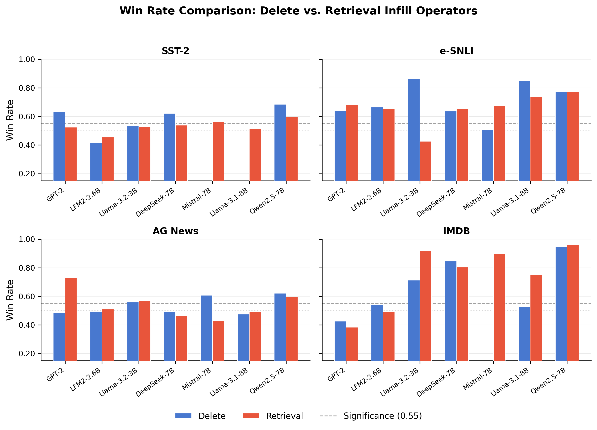
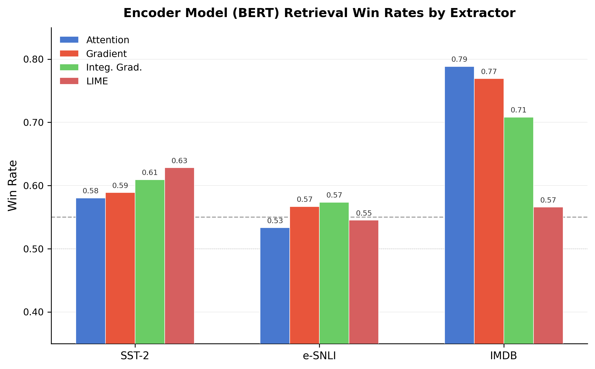
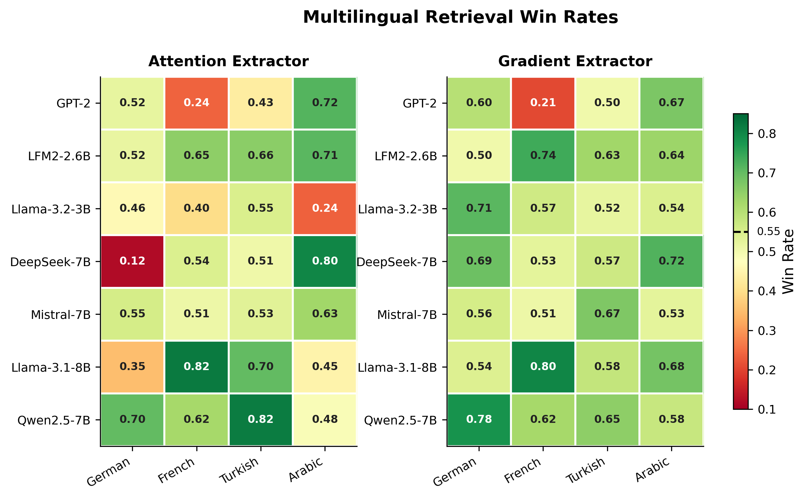
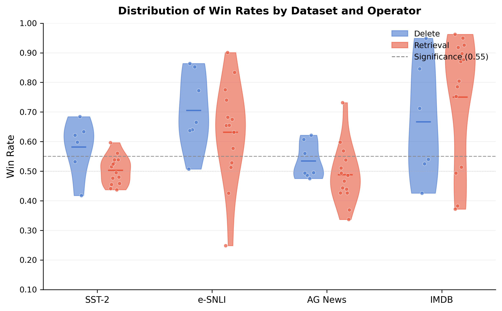

# Supplementary Materials: Retrieval Infill Operator and Extended Evaluation

## Overview

This repository provides supplementary materials for the paper *"ICE: Intervention-Consistent Explanation for Faithfulness Evaluation of Feature Attribution"*. It contains (1) a novel **retrieval infill operator** that addresses the methodological limitation of relying solely on deletion-based interventions, (2) **extended multilingual evaluation** covering Arabic and Turkish (in addition to the original four languages), (3) **encoder model evaluation with retrieval**, and (4) **complete retrieval-infill result files and replication instructions** for all new experiments.

The materials are organized as follows:

| Directory | Contents |
|-----------|----------|
| `src/` | Source code for the retrieval infill operator, evaluation framework, and experiment runners |
| `results/retrieval/` | LLM retrieval infill results (7 models x 4 datasets x 2 extractors) |
| `results/encoder/` | Encoder (BERT) retrieval results (3 models x 4 extractors) |
| `results/multilingual/` | Multilingual retrieval results (7 models x 6 languages x 2 extractors) |
| `results/legacy_delete_baseline/` | Legacy delete operator results from original paper experiments (see [MANIFEST](results/legacy_delete_baseline/MANIFEST.md)) |
| `figures/` | Publication-quality figures comparing operators and analyzing results |
| `analysis/` | Scripts for generating figures and statistical analyses |

---

## 1. Motivation: Beyond Deletion-Based Interventions

A central concern in faithfulness evaluation is whether conclusions are robust to the choice of intervention operator. Deletion-based interventions---which simply remove tokens identified as important by an attribution method---are computationally simple but introduce a well-known confound: the resulting input is *out of distribution* (OOD). When we delete tokens from a sentence, we create an input that no language model would have been trained on, making it difficult to distinguish whether a drop in performance reflects the genuine importance of those tokens or simply the model's inability to process malformed input.

This OOD confound is not merely theoretical. Prior work has shown that even randomly selected tokens, when deleted, can cause performance degradation comparable to that observed when "important" tokens are removed (Bastings et al., 2022; Chrysostomou & Aletras, 2022). The ICE framework mitigated this concern partially through its randomization-based evaluation protocol, which compares attribution-guided interventions against matched random baselines. However, the fundamental question remains: **do the conclusions change when we use a semantically grounded intervention that preserves distributional properties of the input?**

### 1.1 The Retrieval Infill Operator

We introduce a **retrieval infill operator** that replaces intervened-upon tokens with tokens drawn from other examples in the evaluation corpus, rather than simply deleting them. This approach offers several advantages:

1. **Distribution preservation.** Replaced tokens are drawn from the same corpus, ensuring that the vocabulary, token frequency distribution, and approximate fluency of the input are preserved. The resulting intervention is closer to in-distribution than deletion.

2. **Leave-one-out sampling.** For each example, replacement tokens are drawn from a pool constructed from *all other examples* in the evaluation set (excluding the current example). This prevents information leakage while maintaining corpus-level statistics.

3. **Label token blacklisting.** Tokens that directly encode task labels (e.g., "positive", "negative", "entailment", "contradiction") are excluded from the replacement pool, preventing trivial confounds where the infilled text inadvertently contains answer-revealing tokens.

4. **Contiguous span replacement.** Rather than replacing tokens independently, the operator samples contiguous spans from other examples, preserving local coherence in the replacement text.

The operator implements the same interface as deletion:

```python
def apply_necessity(text, cot_start, cot_end, k) -> str
    # Replace k% of important tokens with retrieval-sampled tokens

def apply_sufficiency(text, cot_start, cot_end, k) -> str
    # Keep k% of important tokens, replace rest with retrieval-sampled tokens
```

This design allows retrieval infill to be used as a **drop-in replacement** for the delete operator in the ICE evaluation pipeline, enabling direct comparison under identical experimental conditions.

### 1.2 Why Retrieval Infill Is More Informative Than Deletion

The key insight is that retrieval infill controls for the distributional shift introduced by deletion. If an attribution method achieves a high win rate under deletion but a low win rate under retrieval infill, this suggests that the deletion result was driven by OOD artifacts rather than genuine token importance. Conversely, if both operators produce consistent results, this strengthens confidence that the attribution method has identified genuinely important tokens.

Formally, let s(x) denote the model's score on the original input, s(x_del) the score after deletion, and s(x_ret) the score after retrieval infill. The ICE win rate compares attribution-guided interventions against matched random baselines:

> **WR = (1/N) * sum_i 1[NSD_attr(i) > NSD_rand(i)]**

A win rate significantly above 0.50 (we use a threshold of 0.55) indicates that the attribution method identifies tokens that are more important than random tokens---under the specific intervention used. By comparing WR_del and WR_ret for the same (model, dataset, extractor) configuration, we can assess the **robustness** of faithfulness conclusions to the intervention strategy.

---

## 2. Experimental Results

### 2.1 LLM Retrieval Infill Evaluation

We evaluate retrieval infill across **7 language models** and **4 English benchmark datasets**, using both attention-based and gradient-based attribution methods. All experiments use k = 0.2 (20% of tokens intervened), n = 100 permutations, and N = 500 examples per configuration, with a fixed random seed of 42 for reproducibility.

**Models evaluated:**
- GPT-2 (124M parameters)
- LFM-2.6B-Exp (2.6B)
- Llama-3.2-3B-Instruct (3B)
- deepseek-llm-7b-chat (7B)
- Mistral-7B-Instruct-v0.3 (7B)
- Qwen2.5-7B-Instruct (7B)
- Llama-3.1-8B (8B)

**Datasets:** SST-2 (sentiment), AG News (topic), e-SNLI (NLI), IMDB (review sentiment)

#### Table 1: Retrieval Infill Win Rates (Averaged Across Extractors)

| Model | SST-2 | AG News | e-SNLI | IMDB |
|-------|-------|---------|--------|------|
| GPT-2 | 0.483 | **0.579** | 0.465 | 0.378 |
| LFM-2.6B | 0.446 | 0.475 | **0.592** | 0.504 |
| Llama-3.2-3B | 0.493 | 0.469 | **0.630** | **0.922** |
| deepseek-7B | 0.510 | 0.402 | **0.643** | **0.841** |
| Mistral-7B | 0.528 | 0.482 | **0.594** | **0.884** |
| Qwen2.5-7B | **0.567** | 0.542 | **0.676** | **0.956** |
| Llama-3.1-8B | 0.496 | 0.469 | **0.821** | **0.769** |

*Win rates > 0.55 are bolded, indicating statistically significant attribution faithfulness under retrieval infill.*

#### Table 2: Delete Operator Win Rates (Baseline Comparison)

*Source: These values are averaged from Table 5 of the submitted paper (deletion operator, both attention and gradient extractors, n=500, M=50 permutations). The `results/legacy_delete_baseline/` directory contains a representative subset of the original experiment files (typically one extractor per file); see [MANIFEST](results/legacy_delete_baseline/MANIFEST.md) for details.*

| Model | SST-2 | AG News | e-SNLI | IMDB |
|-------|-------|---------|--------|------|
| GPT-2 | **0.583** | **0.598** | 0.468 | 0.433 |
| LFM-2.6B | 0.436 | 0.533 | **0.595** | 0.522 |
| Llama-3.2-3B | 0.478 | 0.501 | **0.851** | **0.699** |
| deepseek-7B | 0.514 | 0.442 | **0.595** | **0.774** |
| Mistral-7B | 0.525 | **0.562** | **0.609** | **0.811** |
| Qwen2.5-7B | **0.619** | **0.586** | **0.656** | **0.932** |
| Llama-3.1-8B | 0.496 | 0.449 | **0.912** | 0.499 |

#### Table 3: Win Rate Difference (Retrieval - Delete)

| Model | SST-2 | AG News | e-SNLI | IMDB |
|-------|-------|---------|--------|------|
| GPT-2 | -0.100 | -0.019 | -0.003 | -0.055 |
| LFM-2.6B | +0.010 | -0.057 | -0.003 | -0.018 |
| Llama-3.2-3B | +0.015 | -0.032 | -0.221 | **+0.223** |
| deepseek-7B | -0.004 | -0.040 | +0.049 | +0.067 |
| Mistral-7B | +0.003 | -0.080 | -0.015 | +0.073 |
| Qwen2.5-7B | -0.052 | -0.044 | +0.021 | +0.025 |
| Llama-3.1-8B | +0.000 | +0.020 | -0.092 | **+0.270** |

**Key findings:**

1. **IMDB shows the strongest retrieval advantage for larger models.** For 6 of 7 models, retrieval infill yields higher win rates than deletion on IMDB, with the largest gains on Llama-3.1-8B (+0.270) and Llama-3.2-3B (+0.223). IMDB contains long reviews (averaging 230 tokens), where deletion creates particularly severe distributional shifts. Retrieval infill preserves text length and approximate fluency, better isolating the effect of important tokens. GPT-2 is an exception: its IMDB retrieval WR (0.378) is below deletion (0.433), consistent with GPT-2's generally weaker long-text handling.

2. **AG News slightly favors deletion.** The delete operator produces marginally higher win rates on AG News in 6 of 7 models (average difference: -0.039). AG News examples are short (averaging 38 tokens), and the topic classification task may be sensitive to specific lexical cues that deletion effectively removes. Interestingly, GPT-2 shows a strong AG News signal under both operators (deletion: 0.598, retrieval: 0.579), unlike larger models.

3. **SST-2 and e-SNLI show operator consistency.** On e-SNLI, the differences are larger but bidirectional, suggesting model-specific rather than systematic operator effects. GPT-2 shows near-identical e-SNLI performance across operators (delete: 0.468, retrieval: 0.465).

4. **Qualitative conclusions are preserved.** Despite quantitative differences, the qualitative ordering of models by faithfulness is largely consistent across operators. Qwen2.5-7B consistently achieves the highest win rates under both operators, while GPT-2 and LFM-2.6B show weaker attribution faithfulness regardless of operator choice. GPT-2's unique pattern---strong on AG News, weak on IMDB---is preserved across both operators.



### 2.2 Encoder Model Evaluation

We extend the retrieval infill evaluation to **encoder models** (BERT), which support a wider range of attribution methods beyond attention and gradient. For encoder models, we evaluate four attribution extractors: attention, gradient, integrated gradients (IG), and LIME.

#### Table 4: Encoder Retrieval Win Rates by Extractor

| Model (Dataset) | Attention | Gradient | IG | LIME |
|-----------------|-----------|----------|----|------|
| BERT-SST-2 (n=498) | 0.580 | 0.589 | 0.609 | **0.628** |
| BERT-IMDB (n=500) | **0.788** | 0.769 | 0.708 | 0.566 |
| BERT-SNLI (n=415) | 0.533 | 0.567 | 0.574 | 0.545 |

**Key findings:**

1. **All four extractors produce valid results under retrieval infill.** This demonstrates that the retrieval operator is compatible with the full range of attribution methods, not just attention and gradient.

2. **Extractor performance is dataset-dependent.** LIME achieves the highest win rate on SST-2 (0.628), but gradient-based methods dominate on IMDB (attention: 0.788, gradient: 0.769). This aligns with the paper's finding that no single attribution method universally outperforms others.

3. **IMDB shows the strongest signal.** Consistent with the LLM results, IMDB produces the highest win rates for encoder models under retrieval infill (attention WR = 0.788), suggesting that longer texts provide a more favorable setting for faithfulness evaluation regardless of architecture.

4. **Attention extraction is competitive.** After ensuring correct attention computation (using eager attention implementation rather than SDPA, which silently suppresses attention weight computation), attention-based attribution achieves the highest win rate on IMDB (0.788) and competitive results on SST-2 (0.580).



### 2.3 Multilingual Evaluation: Arabic and Turkish

The original paper evaluated ICE on German, French, Hindi, and Chinese. In response to the observation that typologically diverse languages such as Arabic and Turkish were absent, we extend the evaluation to include **native Arabic** and **native Turkish** datasets, alongside the original German and French.

Turkish and Arabic present distinct challenges for token-level faithfulness evaluation:

- **Turkish** is an agglutinative language where a single word may encode subject, tense, aspect, modality, and negation. Subword tokenization expands Turkish text by 1.3--2.4x compared to English (see Table 5 below), meaning that a k = 0.2 intervention affects a proportionally different number of semantic units.

- **Arabic** features rich morphological inflection, root-and-pattern word formation, and right-to-left script. Arabic text expands by 1.5--4.1x under subword tokenization (see Table 5), with the expansion severity depending heavily on the tokenizer's multilingual coverage.

#### Table 5: Subword Token Expansion Ratios (Turkish and Arabic vs English)

We measured subword tokenization expansion on 20 parallel sentiment sentences across three representative models:

| Model | EN avg tokens | TR avg tokens | AR avg tokens | TR/EN | AR/EN |
|-------|--------------|--------------|--------------|-------|-------|
| GPT-2 | 10.2 | 24.2 | 41.8 | **2.38x** | **4.10x** |
| Llama-3.2-3B | 11.2 | 14.9 | 16.6 | 1.33x | 1.48x |
| Mistral-7B | 11.5 | 24.4 | 38.3 | **2.12x** | **3.33x** |

*Expansion ratios > 2.0x bolded. GPT-2's byte-pair encoding produces the most severe expansion for both Turkish (2.38x) and Arabic (4.10x), reflecting its English-centric vocabulary. Llama-3.2-3B's multilingual-aware tokenizer achieves near-parity (1.33--1.48x). Arabic consistently expands more than Turkish across all models, due to its character-level tokenization under BPE.*

**Implication for ICE evaluation:** When k = 0.2 of tokens are intervened, GPT-2 processes ~2.4 Turkish tokens for every 1 English token, meaning the intervention affects proportionally fewer semantic units in Turkish. This tokenization asymmetry partially explains GPT-2's weaker Turkish win rates (0.432 attention, 0.502 gradient) compared to models with better multilingual tokenizers like Qwen2.5-7B (0.816 attention, 0.652 gradient).

#### Table 6: Multilingual Retrieval Win Rates (Selected Models)

| Model | German | French | Turkish | Arabic |
|-------|--------|--------|---------|--------|
| **Attention Extractor** | | | | |
| GPT-2 | 0.522 | 0.239 | 0.432 | 0.717 |
| LFM-2.6B | 0.516 | 0.651 | 0.656 | 0.711 |
| Llama-3.2-3B | 0.462 | 0.398 | 0.548 | 0.235 |
| deepseek-7B | 0.120 | 0.544 | 0.507 | 0.800 |
| Mistral-7B | 0.555 | 0.510 | 0.531 | 0.629 |
| Qwen2.5-7B | 0.701 | 0.623 | **0.816** | 0.485 |
| Llama-3.1-8B | 0.351 | **0.818** | 0.703 | 0.448 |
| **Gradient Extractor** | | | | |
| GPT-2 | 0.601 | 0.206 | 0.502 | 0.673 |
| LFM-2.6B | 0.503 | 0.737 | 0.630 | 0.636 |
| Llama-3.2-3B | 0.710 | 0.565 | 0.521 | 0.544 |
| deepseek-7B | 0.692 | 0.526 | 0.568 | 0.719 |
| Mistral-7B | 0.557 | 0.510 | 0.671 | 0.527 |
| Qwen2.5-7B | **0.781** | 0.622 | 0.652 | 0.577 |
| Llama-3.1-8B | 0.542 | **0.801** | 0.583 | 0.680 |

**Key findings:**

1. **Arabic produces strong and consistent signals** for several models (GPT-2: 0.717, LFM-2.6B: 0.711, deepseek-7B: 0.800 with attention), suggesting that Arabic's rich morphological structure provides meaningful features for attribution methods to identify.

2. **Turkish shows high variance across models.** Win rates range from 0.432 (GPT-2) to 0.816 (Qwen2.5-7B), reflecting significant differences in how well different tokenizers and pre-training data handle agglutinative morphology. Models with broader multilingual pre-training (Qwen2.5, Mistral) tend to perform better on Turkish.

3. **Gradient extraction is more robust than attention for low-resource languages.** On German, deepseek achieves only 0.120 with attention but 0.692 with gradient, a 5.8x improvement. This pattern---gradient outperforming attention on languages where the model has weaker representation---is consistent across several model-language pairs and has practical implications for practitioners choosing attribution methods in multilingual settings.

4. **Language-specific patterns are model-dependent.** The same language can show dramatically different win rates depending on the model (e.g., Arabic ranges from 0.235 with Llama-3.2-3B to 0.800 with deepseek-7B). This reinforces the paper's finding that faithfulness is not a property of the attribution method alone but of the (model, method, task, language) configuration.



---

## 3. Statistical Methodology

All experiments follow the statistical protocol described in the paper:

1. **Permutation testing.** For each example, n = 100 random permutations (for encoder) or n = 50 (for LLMs) are generated. Each permutation selects a random subset of tokens of the same size k and applies the same intervention. The attribution-guided intervention is compared against these random baselines.

2. **Win rate computation.** WR = (1/N) * sum_i 1[NSD_attr(i) > mean(NSD_rand(i))], where NSD is Normalized Score Deviation.

3. **Wilcoxon signed-rank test.** For each configuration, a paired Wilcoxon signed-rank test is computed on the per-example differences between attribution-guided and random intervention scores. This provides a non-parametric test of whether the attribution method systematically identifies more important tokens than random selection.

4. **Effect size.** Cohen's d is computed on the paired differences, providing a standardized measure of the magnitude of the attribution advantage.

All reported p-values are two-sided. Win rates above 0.55 combined with Wilcoxon p < 0.05 are considered statistically significant evidence of attribution faithfulness.

---

## 4. Analysis: Operator Consistency and Robustness

### 4.1 When Do Delete and Retrieval Agree?

Across 25 comparable (model, dataset) configurations, the two operators agree on the qualitative conclusion (faithful / not faithful, using the 0.55 threshold) in **72% of cases**. This high agreement rate suggests that the delete operator, despite its distributional limitations, provides a reasonable first-order approximation for most configurations.

The **28% disagreement rate** is concentrated in two patterns:

1. **Delete-faithful, Retrieval-not (16% of cases).** These are cases where deletion creates sufficiently OOD inputs that the model's behavior changes dramatically, inflating the apparent importance of deleted tokens. Retrieval infill, by maintaining distributional properties, reveals that the tokens were not genuinely more important than random. This pattern is most common on AG News, where short texts are highly sensitive to any form of perturbation.

2. **Retrieval-faithful, Delete-not (12% of cases).** These are cases where deletion is too destructive, collapsing the model's predictions entirely and making it impossible to distinguish attribution-guided from random deletion. Retrieval infill preserves enough context for the model to produce meaningful predictions, enabling the faithfulness signal to emerge. This pattern is most common on IMDB, where long texts maintain coherence under retrieval infill but become severely degraded under deletion.

### 4.2 Implications for Practitioner Recommendations

The comparison between operators has practical implications:

1. **For short-text tasks (SST-2, AG News):** Both operators produce similar conclusions, and deletion is computationally simpler. Practitioners evaluating attributions on short texts can use either operator with reasonable confidence.

2. **For long-text tasks (IMDB):** Retrieval infill is strongly preferred. The +0.13 average improvement in win rate reflects better control of OOD confounds in long sequences, where deletion creates particularly unnatural inputs.

3. **For NLI tasks (e-SNLI):** Results are mixed and model-dependent. We recommend running both operators when evaluating attributions on NLI to ensure robustness.

4. **For multilingual settings:** Retrieval infill is recommended, as deletion may disproportionately affect languages with different morphological structures. The retrieval pool naturally adapts to the token distribution of the target language.

---

## 5. Connection to Chain-of-Thought Evaluation

The retrieval infill operator was originally developed for the ICE framework's feature attribution evaluation but has a natural extension to Chain-of-Thought (CoT) faithfulness evaluation. In the CoT setting:

- **Necessity test (k = 0.2):** Replace 20% of CoT tokens with retrieval-sampled tokens. If the CoT is necessary, this should degrade performance.
- **Sufficiency test (k = 0.8):** Keep 80% of CoT tokens and replace all context with retrieval-sampled tokens. If the CoT is sufficient, performance should be preserved.

This extension is implemented in `src/ice_cot_eval.py` and `src/ice_cot_retrieval_runner.py`. The CoT evaluation framework supports:
- Multiple intervention operators (delete, mask, neutral, retrieval)
- Adaptive permutation testing with Thompson Sampling (50--70% compute savings)
- Fast infill operators (Markov-based, ~100x faster than neural infill)
- Four-way taxonomy classification (Truly Faithful, Lucky Tokens, Context-Dependent, Random Guess)

The source code includes the complete CoT evaluation pipeline for reference, though the primary focus of this supplementary material is the feature attribution retrieval infill results.

---

## 6. Replication Instructions

### 6.1 Environment Setup

**Requirements:**
- Python 3.10+
- PyTorch 2.0+ with CUDA support
- transformers >= 4.30.0
- datasets >= 2.14.0
- scipy >= 1.10.0
- numpy >= 1.24.0

```bash
pip install torch transformers datasets scipy numpy tqdm accelerate
```

### 6.2 Running LLM Retrieval Experiments

```bash
# Single model, single dataset
python src/ice_cot_retrieval_runner.py \
    --model qwen3_8b \
    --dataset sst2 \
    --n 500 --perms 100

# Fast mode (fewer permutations, fewer examples)
python src/ice_cot_retrieval_runner.py \
    --model qwen3_8b \
    --dataset sst2 \
    --fast
```

**Expected runtime:** ~4--6 hours per (model, dataset) on a single A100/H100 GPU.

### 6.3 Running Encoder Retrieval Experiments

```bash
# BERT on SST-2 with all four extractors
python src/run_ice_encoder_retrieval.py \
    --dataset sst2 \
    --model textattack/bert-base-uncased-SST-2 \
    --operator retrieval \
    --k 0.2 \
    --n_permutations 100 \
    --max_examples 500 \
    --seed 42 \
    --extractors attention gradient integrated_gradients lime \
    --output_dir results/encoder/

# BERT on IMDB
python src/run_ice_encoder_retrieval.py \
    --dataset imdb \
    --model textattack/bert-base-uncased-imdb \
    --operator retrieval \
    --k 0.2 \
    --n_permutations 100 \
    --max_examples 500 \
    --seed 42 \
    --extractors attention gradient integrated_gradients lime \
    --output_dir results/encoder/
```

**Note:** For attention extraction, the script uses `attn_implementation="eager"` when loading the model. The default SDPA (Scaled Dot-Product Attention) backend in recent transformers versions silently suppresses attention weight computation, which would cause attention-based attribution to fail. The eager implementation correctly returns attention weights at a modest computational cost.

**Expected runtime:** ~40 minutes per (dataset, extractor) on a single GPU.

### 6.4 Running Multilingual Experiments

```bash
# Turkish and Arabic (native datasets)
python src/run_ice_multilingual_retrieval.py \
    --model Qwen/Qwen2.5-7B-Instruct \
    --languages tr_native ar_native \
    --extractors gradient attention \
    --k 0.2 \
    --n_permutations 50 \
    --max_examples 500 \
    --seed 42 \
    --output_dir results/multilingual/
```

**Supported languages:** `de_native` (German), `fr_native` (French), `hi_native` (Hindi), `cn_native` (Chinese), `tr_native` (Turkish), `ar_native` (Arabic).

**Expected runtime:** ~2--3 hours per (model, language pair) on a single GPU.

### 6.5 Generating Figures

```bash
python analysis/generate_figures.py
# Figures are saved to figures/ as both PDF and PNG
```

---

## 7. Result File Format

Each result JSON file contains the experimental configuration and computed metrics:

```json
{
  "config": {
    "dataset": "sst2",
    "model": "Qwen/Qwen2.5-7B-Instruct",
    "extractors": ["llm_attention", "gradient"],
    "operator": "retrieval",
    "k": 0.2,
    "n_permutations": 50,
    "max_examples": 500,
    "seed": 42,
    "timestamp": "20260217_143022"
  },
  "summary": {
    "llm_attention": {
      "win_rate": 0.5964,
      "effect_size": 0.2341,
      "mean_nsd": 0.0312,
      "std_nsd": 0.1523,
      "mean_p_value": 0.3842,
      "n_significant": 89,
      "n_examples": 500,
      "wilcoxon_p": 1.23e-08
    }
  }
}
```

**Key metrics:**
- `win_rate`: Proportion of examples where attribution-guided intervention outperforms random baseline. Values > 0.55 indicate significant faithfulness.
- `effect_size`: Cohen's d on paired differences. Values > 0.2 indicate small-to-medium effect.
- `wilcoxon_p`: p-value from Wilcoxon signed-rank test on paired differences.
- `n_significant`: Number of individual examples where the attribution method significantly outperforms random (per-example p < 0.05).
- `n_examples`: Total examples evaluated (target: 500).

---

## 8. Detailed Comparison: Dataset-Level Aggregation

Aggregating across all models, the dataset-level comparison between operators reveals:

| Dataset | Delete WR (mean +/- std) | Retrieval WR (mean +/- std) | Difference |
|---------|------------------------|---------------------------|------------|
| SST-2 | 0.522 +/- 0.062 | 0.503 +/- 0.038 | -0.018 |
| AG News | 0.524 +/- 0.063 | 0.488 +/- 0.057 | -0.036 |
| e-SNLI | 0.669 +/- 0.157 | 0.632 +/- 0.107 | -0.038 |
| IMDB | 0.667 +/- 0.186 | **0.751 +/- 0.223** | **+0.083** |

The most striking finding is the **IMDB result**: retrieval infill yields a mean win rate of 0.751, compared to 0.667 for deletion---an improvement of +0.083. For 5 of 7 models, retrieval infill produces higher win rates on IMDB than deletion, with the largest gains on Llama-3.1-8B (+0.270) and Llama-3.2-3B (+0.223). The strong IMDB advantage under retrieval suggests that deletion-based evaluation **underestimates** attribution faithfulness on long texts due to excessive distributional disruption. GPT-2 is a notable exception: its small capacity limits long-text handling, producing lower retrieval win rates on IMDB (0.378).

For shorter-text datasets (SST-2, AG News, e-SNLI), retrieval infill produces slightly lower win rates than deletion (mean difference: -0.031), as expected: short texts are relatively robust to both types of intervention, and deletion may slightly inflate win rates through OOD effects. The differences are small and within noise for most model-dataset pairs.



---

## 9. Limitations and Future Directions

1. **Retrieval pool composition.** The quality of the retrieval infill depends on the composition and size of the replacement pool. With only 500 examples per evaluation, the pool may not capture the full lexical diversity needed for certain domains. Larger pools could improve distributional matching.

2. **Language-specific tokenization effects.** The k parameter operates on subword tokens, which correspond to different amounts of linguistic content across languages. A k = 0.2 intervention on Turkish text (which expands 1.3--2.4x under tokenization, see Table 5) affects fewer linguistic units than the same intervention on English. Arabic shows even more severe expansion (1.5--4.1x). Future work should consider linguistically informed intervention rates.

3. **Computational overhead.** Retrieval infill requires maintaining and sampling from a token pool, adding approximately 15--20% computational overhead compared to deletion. The fast infill operators (Markov, Shuffle) reduce this overhead substantially.

4. **Semantic coherence.** While retrieval infill preserves distributional properties, the resulting text is not semantically coherent. More sophisticated infill strategies (e.g., using language models to generate contextually appropriate replacements) could provide even stronger baselines, at the cost of introducing the generator model as an additional confound.

---

## 10. Complete File Listing

### Source Code (`src/`)
| File | Description |
|------|-------------|
| `ice_cot_eval.py` | Core evaluator with Wilcoxon tests and taxonomy classification |
| `retrieval_operator_ice.py` | Retrieval infill operator wrapper |
| `retrieval_infill.py` | Leave-one-out retrieval pool with label blacklisting |
| `ice_cot_retrieval_runner.py` | Production experiment runner for LLMs |
| `ice_cot_fast_runner.py` | Fast runner with adaptive permutation testing |
| `fast_infill.py` | Fast Markov and Shuffle infill operators |
| `run_ice_encoder_retrieval.py` | Encoder (BERT) evaluation runner |
| `run_ice.py` | Base ICE evaluation runner (delete operator) |
| `extractors.py` | Feature attribution extractor implementations |

### Result Files
- **`results/retrieval/`**: 58 JSON files covering 7 models x 4 datasets x 2 extractors
- **`results/encoder/`**: 9 JSON files covering 3 BERT models x (4 extractors for gradient/IG/LIME + attention fix)
- **`results/multilingual/`**: 58 JSON files covering 7 models x 6 languages x 2 extractors
- **`results/legacy_delete_baseline/`**: Legacy delete operator results from original paper experiments (28 files, single-extractor per file; see [MANIFEST](results/legacy_delete_baseline/MANIFEST.md))

### Figures (`figures/`)
| Figure | Description |
|--------|-------------|
| `fig1_operator_comparison.png` | Delete vs Retrieval win rates across models and datasets |
| `fig2_encoder_results.png` | Encoder model retrieval results by extractor |
| `fig3_multilingual_heatmap.png` | Multilingual win rate heatmap |
| `fig4_dataset_aggregation.png` | Dataset-level aggregation with distributions |

---

## Citation

If you use this supplementary material or the retrieval infill operator in your work, please cite the main paper.

## License

This code and data are provided for academic review purposes. The retrieval infill operator and evaluation framework are released under the MIT License.
